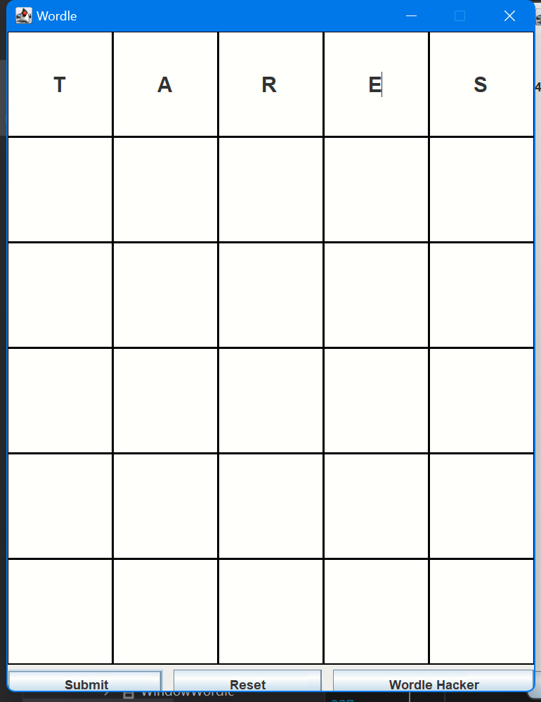
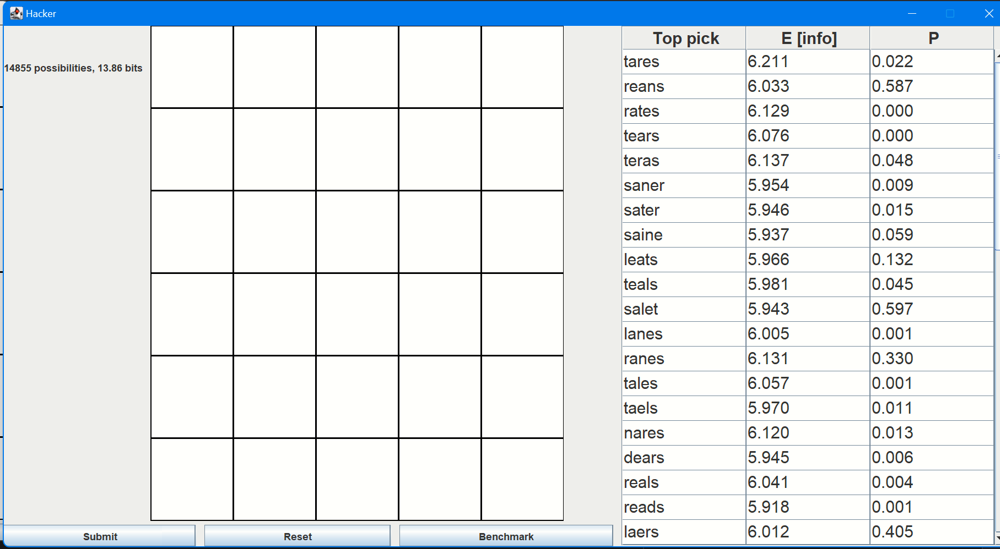
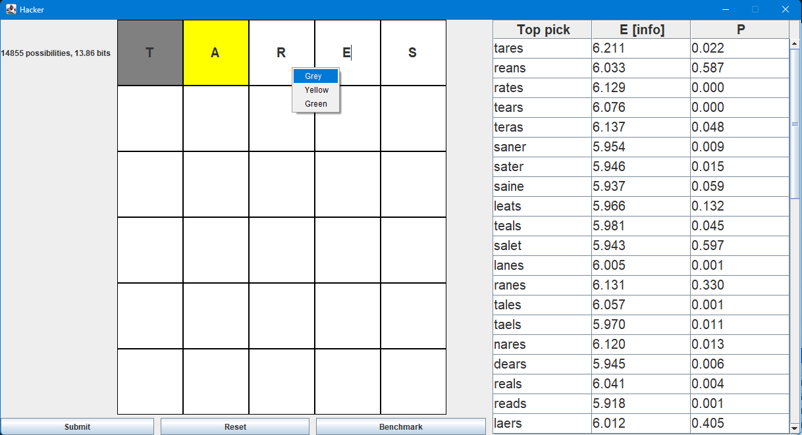
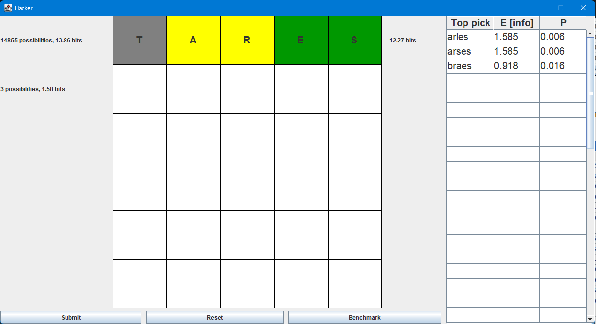
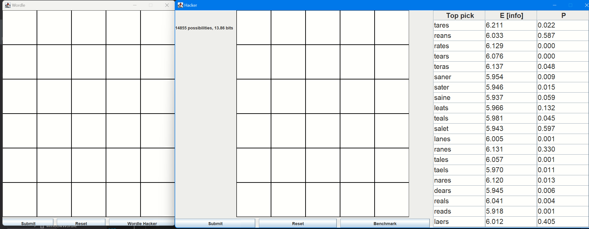
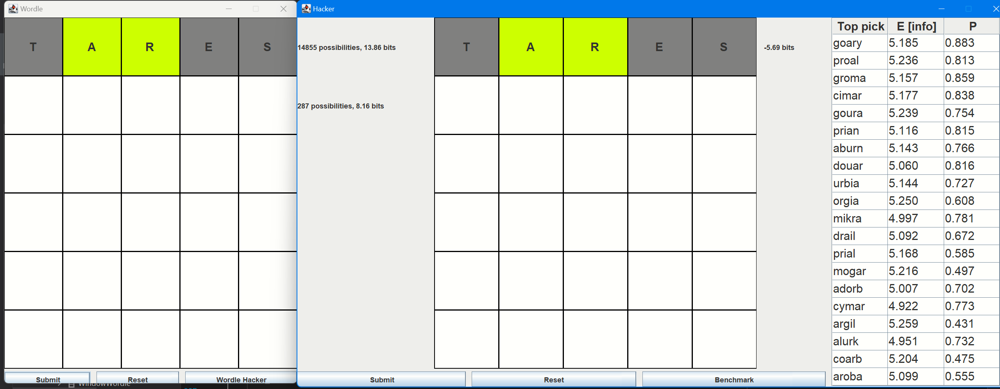
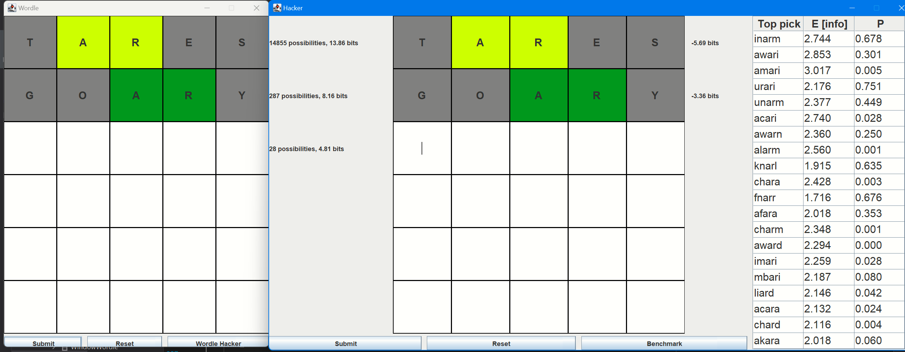
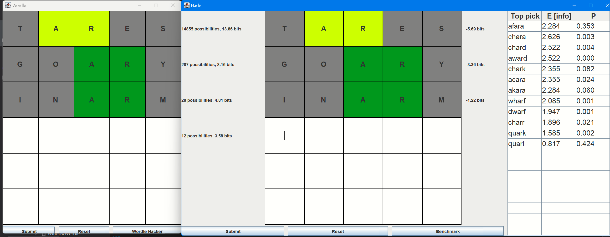
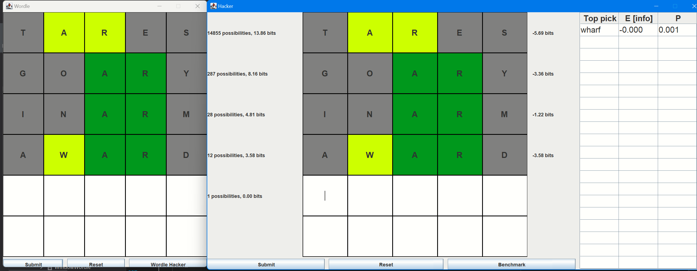
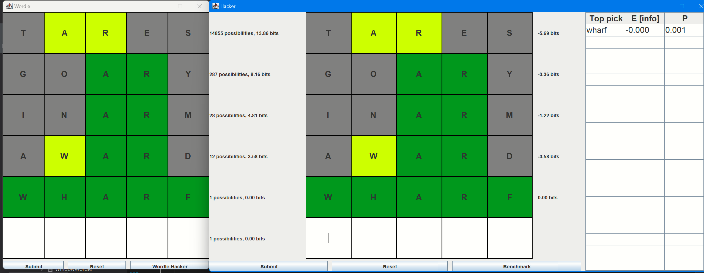

There are two windows in this application. 

Each window can work separately or together, so the user can use the hacker to play with the real wordle game. when both of window are opened, the Hacker window will its statics based on the Wordle window.

### Wordle

Wordle window is simply wordle game that allow user to play multiply times.

'**sumbit**' button will check the word's pattern between and move on the the next try.

'**reset**' button will restart the game and set the answer to a new random word

'**Wordle Hacker**' button will open a new window named Hacker

### Hacker

Hacker window displays statics of the wordle game

There is a table at the right side of the Hacker window, which displays the entropy and probability to be a common word in legitimate word list.

Right click the input box in wordle grid will popup a menu, that allows the user to set the pattern of each guess

once a valid pattern is set to a word, clicking the submit button will update the legitimate word list and sort them by its entropy

after each submition, the hacker will display how much word in the legitimate words, and the remaining information in terms of bits at the left of the wordle grid. Also, it displays how much information reduced after each try.

You can open the real wordle game, choose a guess from the legitimate word list, and set the pattern responsed by the real wordle, to get recommendation for next try.

### Wordle and Hacker can work together

Steps on playing this game when using Wordle and Hacker

1. enter a word to the Wordle windwow and click the submit button

2. The wordle grid on both wordle window and hacker will set to pattern by comparing the wordle answer. Also, the list of legitimate will be updated. 

3. choose one of the word from Hacker's word list and type into the Wordle window. Then press submit in wordle window to get the pattern and updated word list.

4. Keep tring words to get the all green pattern.
